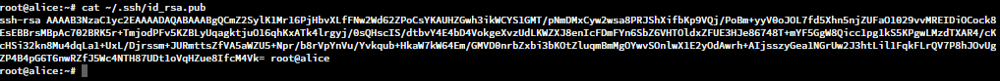

# Ubuntu

In this Tutorial we will learn how to commit our changes to git using SSH with Ubuntu.

## Step 1: Create a key

Create a new SSH key pair if you do not have one already.

If not run the following command:

```
ssh-keygen
```

Next copy the output of your PUBLIC key:

```
cat ~/.ssh/id_rsa.pub
```



## Step 2: Add the key to GitHub

Go to https://github.com/settings/keys and click "New SSH key"


You should name the key from where you would be using the key from.


Click "Add SSH Key" to finish adding it.

## Testing

If you would like to test if everything worked run the following command:

```
ssh -T git@github.com
```

You should get an output like this:

```
Hi james-gavin! You've successfully authenticated, but GitHub does not provide shell access.
```

## Conclusion

You have now created an SSH key to use with GitHub!

When cloning a GitHub repository make sure you select "SSH" instead of "HTTPS" as your remote origin.
